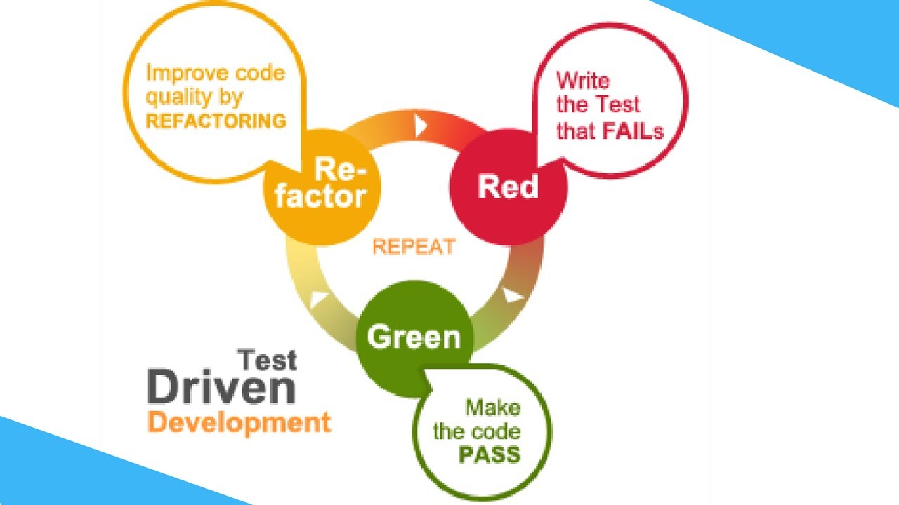

# tdd-with-quarkus

## pre-requisites

### For environnent

1. you must have a running docker (in my case Colima)

```shell script
    colima start
```

2. chech it works with docker ps command

```shell script
    docker ps
```

2. export your docker sock in the DOCKER_HOST environment variable

Exemple with Colima

```shell script
export DOCKER_HOST="unix:///$HOME/.colima/default/docker.sock"

```

### For Java

1. Install [sdkman](https://sdkman.io/install/)

Run theses commands :

```shell script
curl -s "https://get.sdkman.io" | bash

source "$HOME/.sdkman/bin/sdkman-init.sh"

sdk version
```

2. Install java sdk 21 and quarkus cli with sdkman

```shell script
sdk install java 21.0.7-tem

sdk install quarkus
```

3. Checkout the project https://github.com/enwoolmfr/tdd-with-quarkus in branc tuto1-fizz-buzz-init

```shell script
git clone 

unzip

```   

4. Check it works, and launch Quarkus in dev mode !!

```shell script
./mvnw quarkus:dev
```

### Quick Quarkus Env presenation

in a console, with quarkus process running, please press h
to show the help menu

```shell script
./mvnw quarkus:dev
....

__  ____  __  _____   ___  __ ____  ______ 
 --/ __ \/ / / / _ | / _ \/ //_/ / / / __/ 
 -/ /_/ / /_/ / __ |/ , _/ ,< / /_/ /\ \   
--\___\_\____/_/ |_/_/|_/_/|_|\____/___/   
2025-05-20 19:11:06,688 DEBUG [io.sma.config] (Quarkus Main Thread) SRCFG01006: Loaded ConfigSource BuildTime RunTime Fixed with ordinal 2147483647

...
press h 

The following commands are available:

== Continuous Testing

[r] - Re-run all tests
[f] - Re-run failed tests
...

== HTTP

[w] - Open the application in a browser
[d] - Open the Dev UI in a browser
... 

```

Press d in console to open the Dev UI in browser !!

```shell script
./mvnw quarkus:dev
....

__  ____  __  _____   ___  __ ____  ______ 
 --/ __ \/ / / / _ | / _ \/ //_/ / / / __/ 
 -/ /_/ / /_/ / __ |/ , _/ ,< / /_/ /\ \   
--\___\_\____/_/ |_/_/|_/_/|_|\____/___/   
2025-05-20 19:11:06,688 DEBUG [io.sma.config] (Quarkus Main Thread) SRCFG01006: Loaded ConfigSource BuildTime RunTime Fixed with ordinal 2147483647

...
press d 
```

## Concept Red Green Refactor



### Activities : Implements the FizzBuzz game

> [!WARNING]
> In TDD you should respect the Red-Green-Refactor
> in baby steps

### Baby Steps

```pascal
For each functionnnality :
Do :
    Red Step
    Green Step
    Refactor Step
End
````

Ou le workflow en graphique

````mermaid
graph TD
    A((Nouvelle fonctionnalité)) --> B["🔴 Écrire un test (qui échoue)"];
    B -- "Le test échoue (RED)" --> C["🟢 Écrire le code minimal pour que le test passe"];
    C -- "Le test passe (GREEN)" --> D["🔵 Refactoriser le code (améliorer la qualité)"];
    D -- "Les tests passent toujours (REFACTOR)" --> E{"Autre test / fonctionnalité ?"};
    E -- "Oui" --> B;
    E -- "Non / Fin du cycle" --> F((Fin));


    class B red;
    class C green;
    class D blue;
    class E decision;
    class A,F startend;
````

Implemement the Red Step

    - Implements a test like  in FizzBuzzTest   
    - check the test fails !!

Implemement Green Step

    - Implements the FizzBuzz class to pass the when1shouldReturn1 (but only one )

Implemement Refactor Step

    - Implements the FizzBuzz class to pass the when1shouldReturn1 (but only one )

